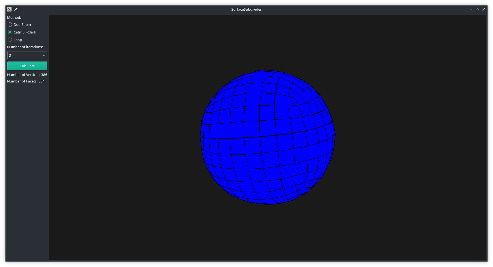
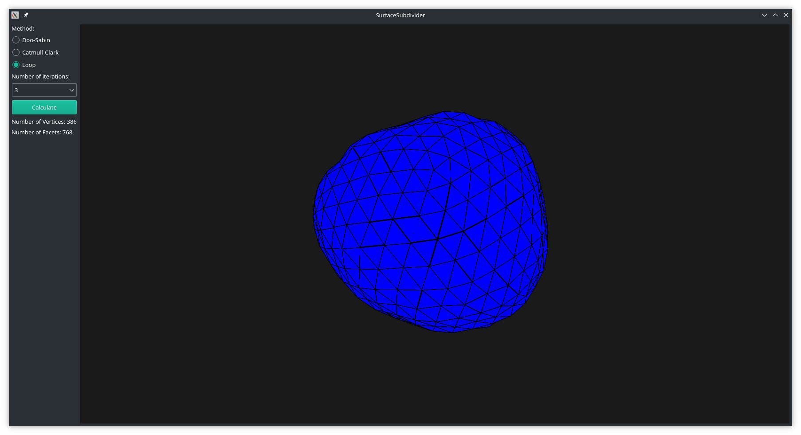

# SurfaceSubdivider

## 简介

本程序实现了三种细分曲面：Doo-Sabin、Catmull-Clark和Loop，并展现了这三种细分曲面作用在立方体上的结果。

## 开发环境

本程序的开发环境如下表所示。

|项目|值|
|:---:|:---:|
|CPU|Intel® Core™ i7-8550U|
|内存|7.7GB|
|操作系统|Manjaro Linux|

本程序开发时用到的一些软件和库以及它们的版本如下表所示。

|软件/库|版本|
|:---:|:---:|
|Linux内核|5.4.85|
|GCC|10.2.0|
|CMake|3.17.5|
|Qt|5.15.2|

其中Qt用于提供图形界面、绘制函数以及图形相关的矩阵计算。

## 使用说明

- 编译并运行程序后，绘制的结果会显示在窗口右侧的部分。
- 在绘制部分点击鼠标左键或右键并拖动，可以对模型进行旋转；滑动鼠标滚轮，可以对模型进行缩放。
- 在左侧的单选框可以对使用的细分曲面算法以及迭代的次数进行选择，选择后完成后可以点击“Calculate”按钮进行计算。
- 按钮下方会显示模型的顶点数和面元数。

## 运行截图

## 类说明

程序中的一些主要的类及它们的说明如下表所示。

|类|说明|
|:---:|:---:|
|Mesh|用于存储三维模型|
|Subdivider|细分曲面算法的基类|
|DooSabinSubdivider|Doo-Sabin细分曲面|
|CatmullClarkSubdivider|Catmull-Clark细分曲面|
|LoopSubdivider|Loop细分曲面|
|RenderWidget|Qt中QOpenGLWidget的子类，即窗口中的绘制组件|
|RenderWindow|Qt中QMainWindow的子类，即程序的主窗口|

## 算法简介

本程序的关键主要在于建立半边数据结构，对模型的每条半边，需要支持查询其上一条、下一条以及对面的半边。
对于半边数据结构的实现主要在Subdivider类中。
完成这一步骤后，只需根据不同的细分曲面，计算新的顶点，并将新的顶点连成网格即可。

## 运行结果

下面三个表格表显示了立方体经过三种细分曲面计算后得到的模型的顶点数和面元数。

Doo-Sabin：

|迭代次数|顶点数|面元数|
|:---:|:---:|:---:|
|0|8|6|
|1|24|26|
|2|96|98|
|3|384|386|
|4|1536|1538|
|5|6144|6146|
|6|24576|24578|
|7|98304|98306|
|8|393216|393218|

Catmull-Clark：

|迭代次数|顶点数|面元数|
|:---:|:---:|:---:|
|0|8|6|
|1|26|24|
|2|98|96|
|3|386|384|
|4|1538|1536|
|5|6146|6144|
|6|24578|24576|
|7|98306|98304|
|8|393218|393216|

Loop：

|迭代次数|顶点数|面元数|
|:---:|:---:|:---:|
|0|8|12|
|1|26|48|
|2|98|192|
|3|386|768|
|4|1538|3072|
|5|6146|12288|
|6|24578|49152|
|7|98306|196608|
|8|393218|786432|